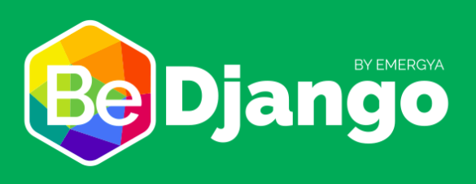

# Jenkins BeDjango Theme

&nbsp;&nbsp;

Are you looking for an awesome Django theme for your Jenkins? You're lucky! Here you have **Jenkins BeDjango Theme**!

In only two steps you will be able to have your theme configured in your Jenkins.

## Installation

1. Install the [Simple Theme Plugin][jenkins-simple-theme] in your Jenkins system.

1. Click `Manage Jenkins`

1. Click `Configure System` and scroll down to `Theme`

1. Specify the URL for [jenkins-bedjango-theme.min.css][jenkins-simple-theme-min].

1. Click `Save`

## Compatibility
- Jenkins 1.6 and above
- Simple Theme plugin 0.3

If you are experiencing issues feel free to let me know.

## Preview

##Thanks to
- [Simple Theme Plugin][jenkins-simple-theme] for the Simple Theme plugin
- [BeDjango][bedjango] for the the design inspiration and for having an awesome team
- [Francisco J. Javier Fernandez][jfernandez89]
- [Open Iconic][open-iconic] for being an inspiration for us. We used some icons from this awesome project!

[jenkins-simple-theme]: https://wiki.jenkins-ci.org/display/JENKINS/Simple+Theme+Plugin
[jenkins-simple-theme-min]: https://cdn.rawgit.com/agomezmoron/jenkins-simple-theme-bedjango/master/dist/css/jenkins-bedjango-theme.min.css
[bedjango]: http://www.lbedjango.com/
[jfernandez89]: https://github.com/jfernandez89
[open-iconic]: https://github.com/iconic/open-iconic
